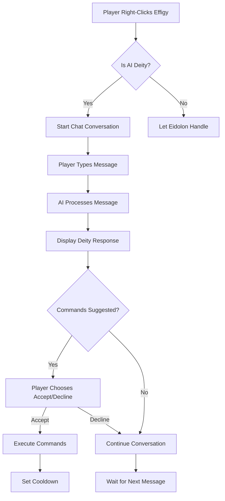

# Altar/Effigy Chat Integration System Documentation

## Overview

The Altar/Effigy Chat Integration System provides **natural chat-based conversations** between players and AI deities through Eidolon's existing shrine/altar mechanics. Players type their own messages to have real conversations with deities, and commands are **suggested, not automatically executed**.

## 🏛️ System Architecture



## 📁 Core Components

### 1. Enhanced Prayer System (`PrayerSystem.java`)

**Location:** `src/main/java/com/bluelotuscoding/eidolonunchained/prayer/PrayerSystem.java`

#### Key Changes:
- **`handleEffigyInteraction()`** now starts conversations instead of auto-generating prayers
- Removed automatic prayer generation and command execution
- Now delegates to `DeityChat.startConversation()`

### 2. Deity Chat System (`DeityChat.java`)

**Location:** `core/src/main/java/com/bluelotuscoding/eidolonunchained/chat/DeityChat.java`

#### Key Features:
- **Chat Event Interception** - Captures player messages when in conversation
- **Natural Conversations** - Players type their own messages
- **Command Suggestions** - AI suggests commands, players choose to accept/decline
- **Conversation State** - Tracks active conversations per player
- **Interactive Buttons** - Clickable [Accept]/[Decline] buttons for commands

#### Core Methods:

- **`startConversation(ServerPlayer player, ResourceLocation deityId)`**
  - Initiates conversation with reputation and cooldown checks
  - Sends AI-generated greeting
  - Sets up conversation state

- **`onPlayerChat(ServerChatEvent event)`**
  - Intercepts chat when player is in conversation
  - Processes player messages and generates AI responses
  - Handles conversation commands (goodbye, accept, decline)

- **`suggestCommands()`**
  - Displays command suggestions with interactive buttons
  - Stores pending commands for player approval
  - Provides clear accept/decline options

### 3. Command System (`DeityCommands.java`)

**Location:** `core/src/main/java/com/bluelotuscoding/eidolonunchained/commands/DeityCommands.java`

#### Registered Commands:
- `/deity_accept_commands` - Accept suggested deity commands
- `/deity_decline_commands` - Decline suggested deity commands

### 4. Enhanced AI Configuration

**Location:** `src/main/resources/data/eidolonunchained/ai_deities/nature_deity_ai.json`

#### Auto-Judgment Configuration:
```json
"conversation": {
  "base_prompt": "Player {player} approaches your sacred altar...",
  "max_commands": 2,
  "cooldown_minutes": 10,
  "reputation_required": 0,
  "allowed_commands": ["give", "effect", "playsound", "weather"],
  "auto_judge_commands": true,
  "judgment_config": {
    "blessing_threshold": 25,
    "curse_threshold": -25,
    "blessing_commands": ["effect give @s regeneration 30 1", "give @s minecraft:golden_apple 1"],
    "curse_commands": ["effect give @s slowness 60 1", "effect give @s weakness 30 0"],
    "neutral_commands": ["playsound minecraft:block.bell.use neutral @s"]
  }
}
```

#### Configuration Options:
- **`auto_judge_commands`** - Toggle automatic command execution based on deity judgment
- **`blessing_threshold`** - Reputation required for blessing commands (default: 25)
- **`curse_threshold`** - Reputation threshold for curse commands (default: -25)
- **Command Categories**:
  - `blessing_commands` - Executed for high reputation players
  - `curse_commands` - Executed for low reputation players  
  - `neutral_commands` - Executed for medium reputation players

### 2. Effigy Interaction Handler (`EffigyInteractionHandler.java`)

**Location:** `src/main/java/com/bluelotuscoding/eidolonunchained/events/EffigyInteractionHandler.java`

**Status:** ⚠️ Currently disabled pending Eidolon dependency setup

#### Features:
- **Event Interception** - Captures `PlayerInteractEvent.RightClickBlock` events
- **Smart Deity Detection** - Maps effigy blocks to specific AI deities
- **Seamless Integration** - Falls back to Eidolon's default system for non-AI deities
- **Proper Cooldown Handling** - Triggers Eidolon's `effigy.pray()` method

#### Event Flow:
1. Player right-clicks effigy block
2. Handler checks if block is an effigy
3. Determines associated deity (if any)
4. Checks effigy readiness (Eidolon cooldown)
5. Delegates to AI system or falls back to Eidolon

### 3. Enhanced AI Configuration

**Location:** `src/main/resources/data/eidolonunchained/ai_deities/nature_deity_ai.json`

#### New Prayer Type: "general"
```json
"general": {
  "base_prompt": "Player {player} approaches your sacred effigy seeking communion...",
  "max_commands": 1,
  "cooldown_minutes": 15,
  "reputation_required": 0,
  "allowed_commands": ["give", "effect", "playsound"]
}
```

#### Benefits:
- **Low Barrier to Entry** - 0 reputation requirement for basic deity contact
- **Contextual Responses** - AI receives detailed player situation data
- **Balanced Interaction** - 15-minute cooldown prevents spam

## 🎮 Player Experience

### Example Conversation Flow:

1. **Interaction**: Player right-clicks nature deity effigy
2. **Greeting**: Verdania: *"Greetings, young seeker. I sense you wish to commune with nature's wisdom. What brings you to my sacred grove?"*
3. **Player Types**: *"I'm lost and don't know which path to take"*
4. **AI Response**: Verdania: *"The forest speaks of many paths, child. Trust in your instincts as animals trust theirs. Would you like my guidance to light your way?"*
5. **Command Suggestion**: 
   ```
   Verdania offers divine assistance:
   • /effect give @s night_vision 300 0
   
   Would you like to accept this assistance? [Accept] [Decline]
   ```
6. **Player Choice**: Player clicks [Accept] or types "yes"
7. **Execution**: Night vision effect applied
8. **Continuation**: Player can continue chatting or type "goodbye" to end

### Chat Interface Features:

- **Natural Typing** - Players type their own messages in chat
- **Conversation State** - Chat is intercepted only during active deity conversations
- **Visual Feedback** - Clear indication when in conversation mode
- **Command Suggestions** - Interactive buttons with hover text
- **Graceful Endings** - Type "goodbye", "end", or "farewell" to conclude

## 🔄 Communication Flow

### Two Interaction Modes:

#### 1. **Manual Approval Mode** (`auto_judge_commands: false`)
- Player types message → AI responds → Commands suggested → Player chooses Accept/Decline
- Full player control over all command execution
- Interactive buttons for easy approval

#### 2. **Auto-Judgment Mode** (`auto_judge_commands: true`)  
- Player types message → AI responds → Deity automatically judges player → Commands execute based on reputation
- **High Reputation (≥25)**: Automatic blessings (healing, golden apples, beneficial effects)
- **Low Reputation (≤-25)**: Automatic curses (slowness, weakness, ominous sounds)
- **Medium Reputation**: Neutral responses (ambient sounds, minor effects)

### Player-to-Deity Communication:
1. Player types message in chat (e.g., "I seek your guidance")
2. System displays: `You: I seek your guidance`
3. System shows: `Verdania considers your words...`
4. AI generates contextual response
5. System displays: `[Verdania] Young seeker, the forest whispers of your potential.`

### Command Execution Process:

#### Manual Mode:
1. AI suggests appropriate commands based on conversation
2. Commands displayed with clear descriptions
3. Interactive [Accept]/[Decline] buttons
4. Commands execute only after explicit player consent

#### Auto-Judgment Mode:
1. Deity evaluates player's reputation and context
2. Automatically selects appropriate command category
3. Commands execute immediately with explanation
4. Example: `Verdania grants divine intervention...` → Regeneration effect applied

## 🧠 Smart Contextual Features

### Player Agency System:

- **🗨️ Natural Communication** - Players type their own messages for authentic interaction
- **🤔 Player Choice** - Commands are suggested, never forced
- **💬 Conversational Flow** - Back-and-forth dialogue instead of one-shot interactions
- **⏰ Flexible Timing** - Conversations can be short or extended based on player interest
- **🎯 Contextual Responses** - AI considers player message content and game context

### Enhanced AI Understanding:

The conversation system includes contextual awareness:
```java
private static String buildConversationPrompt(ServerPlayer player, DatapackDeity deity, 
                                              AIDeityConfig aiConfig, String playerMessage) {
    StringBuilder prompt = new StringBuilder();
    prompt.append("Player ").append(player.getName().getString())
          .append(" says to you: \"").append(playerMessage).append("\"");
    
    // Add game context
    String context = GeminiAPIClient.buildPlayerContext(player);
    prompt.append("\n\nPlayer situation: ").append(context);
    
    // Add conversation guidelines
    prompt.append("\n\nRespond naturally as ").append(deity.getDisplayName())
          .append(". Only suggest commands if specifically asked for help.");
    
    return prompt.toString();
}
```

### Context Categories:

- 💬 **Message-aware responses** - AI responds to actual player input
- ❤️ **Health-responsive** - Mentions player condition when relevant
- 🍖 **Hunger-aware** - Notices player needs contextually  
- ⚔️ **Danger detection** - Responds to threats when mentioned
- 🎯 **Deity-specific** - Each deity maintains unique personality and capabilities
- 📍 **Location-aware** - References player's current biome and position

## 🔧 Configuration

### Adding New Effigy Interactions:

1. **Define Prayer Type** in AI deity configuration:
```json
"prayer_configs": {
  "general": {
    "base_prompt": "Custom prompt with {player} context...",
    "max_commands": 1,
    "cooldown_minutes": 15,
    "reputation_required": 0,
    "allowed_commands": ["give", "effect", "playsound"]
  }
}
```

2. **Map Deity to Effigy** in `EffigyInteractionHandler.getEffigyDeity()`:
```java
private static ResourceLocation getEffigyDeity(EffigyTileEntity effigy, BlockPos pos) {
    // Add your deity mapping logic here
    return new ResourceLocation("modid", "deity_id");
}
```

### Customizing Context Generation:

Extend `generateContextualPrayer()` with additional checks:
- Player inventory items
- Nearby blocks or structures
- Biome-specific conditions
- Player achievements or progression
- Current weather conditions

## 📋 Implementation Status

### ✅ Completed Features:
- Natural chat-based conversation system
- Player message input through normal chat interface
- Command suggestion system with player approval
- Interactive accept/decline buttons for commands
- Conversation state management
- Deity greeting system with contextual AI responses
- "conversation" prayer type for extended dialogue
- Command execution with player consent
- Graceful conversation ending with farewell detection

### ⚠️ Pending Tasks:
- **Eidolon Dependency Setup** - Add proper build.gradle dependency
- **Event Handler Activation** - Uncomment EffigyInteractionHandler code
- **Enhanced Deity Mapping** - More sophisticated effigy-to-deity association

### 🚀 Future Enhancements:
- **Multi-turn Memory** - AI remembers conversation context across messages
- **Emotional States** - Deities remember player actions and respond accordingly
- **Quest Integration** - Deities can give and track custom quests through conversation
- **Voice Commands** - Integration with voice-to-text for spoken prayers
- **Conversation History** - Log and recall previous conversations with deities

## 🛠️ Development Notes

### Build Integration:

To activate the full system:

1. **Add Eidolon Dependency** to `build.gradle`:
```gradle
dependencies {
    implementation fg.deobf("elucent.eidolon:eidolon:VERSION")
}
```

2. **Uncomment Event Handler** in `EffigyInteractionHandler.java`
3. **Test Integration** with actual Eidolon effigy blocks

### Debugging:

- Enable debug logging in `EffigyInteractionHandler` for interaction tracking
- Monitor cooldown behavior for proper integration
- Test fallback to Eidolon's default system

### Performance Considerations:

- Contextual prayer generation is lightweight (< 1ms)
- AI API calls are asynchronous to prevent blocking
- Cooldown system prevents excessive API usage
- Event handler only processes relevant block interactions

## 🎯 Integration Benefits

1. **Seamless User Experience** - Natural right-click interactions
2. **Contextual Intelligence** - AI understands player situation
3. **Eidolon Compatibility** - Respects existing cooldowns and mechanics
4. **Scalable Architecture** - Easy to add new deities and interaction types
5. **Immersive Gameplay** - Prominent visual feedback and contextual responses

## 📖 Usage Examples

### Auto-Judgment Mode Examples:

#### High Reputation Player (≥25):
```
Player: *right-clicks nature deity effigy*
Verdania: "Beloved guardian of the green world, your dedication honors me. How may I assist you today?"
Player: "I'm feeling weak after a long journey"
Verdania: "Let the ancient strength of the forest flow through you, trusted one."
System: "Verdania grants divine intervention..."
Effect: Regeneration III for 30 seconds + Golden Apple given
```

#### Low Reputation Player (≤-25):
```  
Player: *right-clicks nature deity effigy*
Verdania: "Your presence disturbs the natural balance. Why do you dare approach?"
Player: "I want power over nature"
Verdania: "Your greed corrupts the very air around you. Feel nature's displeasure."
System: "Verdania expresses divine displeasure..."
Effect: Slowness II for 60 seconds + Ominous witch sounds
```

#### Medium Reputation Player:
```
Player: "I'm lost and need direction"
Verdania: "The path forward requires patience and wisdom. Listen to the forest's guidance."
System: "Verdania acknowledges your presence..."
Effect: Peaceful bell sound plays
```

### Manual Approval Mode Examples:

#### Blessing Request:
```
Player: "I'm badly injured, can you heal me?"
Verdania: "I sense your pain, young one. Shall I mend your wounds?"
Command Suggestion: /effect give @s regeneration 60 2
Player: [Accepts] → Regeneration effect applied
```

#### Declined Assistance:
```
Player: "I need food but I want to earn it myself"
Verdania: "Your self-reliance honors the natural way."
Command Suggestion: /give @s bread 8
Player: [Declines]
Verdania: "May your hunt be successful, independent spirit."
```

---

*This system provides the foundation for meaningful, AI-powered deity interactions that feel natural and integrated with Eidolon's existing mechanics.*
