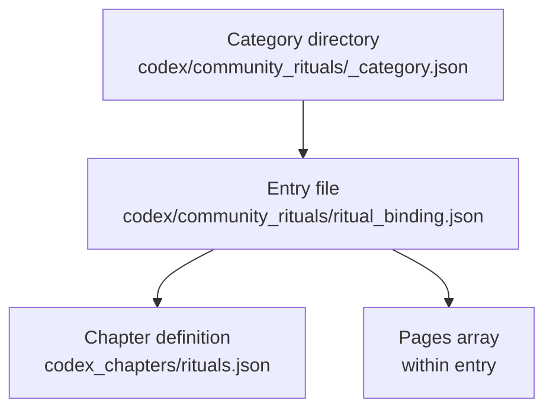

# Datapack Category → Chapter → Page Linking

All paths below are relative to the repository root.

## Directory Structure

- `src/main/resources/data/eidolonunchained/codex/<category>/_category.json` – defines a codex category.
- `src/main/resources/data/eidolonunchained/codex_chapters/<chapter>.json` – declares a chapter that entries can target.
- `src/main/resources/data/eidolonunchained/codex/<category>/<entry>.json` – codex entry file representing a page within the category. Each entry specifies `target_chapter` to link to a chapter and provides page content via its `pages` array.

## Example

- Category: `src/main/resources/data/eidolonunchained/codex/community_rituals/_category.json`
- Chapter: `src/main/resources/data/eidolonunchained/codex_chapters/rituals.json`
- Page: `src/main/resources/data/eidolonunchained/codex/community_rituals/ritual_binding.json` (contains `"target_chapter": "rituals"` and a `pages` array.)

## Data Flow

The game reads each category folder, loads entries within it, uses each entry's `target_chapter` to locate chapter definitions, and then renders the `pages` array as in-game pages.
