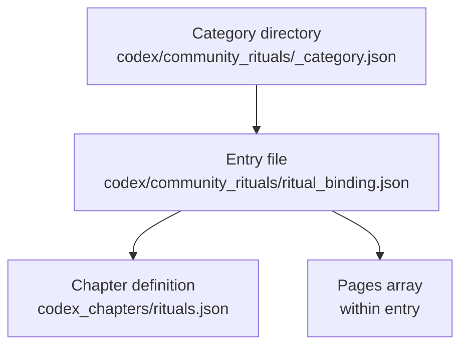

# Datapack Category → Chapter → Page Linking

All paths below are relative to the repository root.

## Directory Structure

- `src/main/resources/data/eidolonunchained/codex/<category>/_category.json` – defines a codex category.
- `src/main/resources/data/eidolonunchained/codex_chapters/<chapter>.json` – declares a chapter that entries can target.
- `src/main/resources/data/eidolonunchained/codex/<category>/<entry>.json` – codex entry file representing a page within the category. Each entry specifies `target_chapter` to link to a chapter and provides page content via its `pages` array.

> **Choosing a directory**
> - Use `codex_entries/` for quick one-off additions to existing chapters.
> - Use `codex/<category>/` when you want a dedicated tab or to bundle multiple related entries. Each category folder requires a `_category.json` definition.

## Example

- Category: `src/main/resources/data/eidolonunchained/codex/community_rituals/_category.json`
- Chapter: `src/main/resources/data/eidolonunchained/codex_chapters/rituals.json`
- Page: `src/main/resources/data/eidolonunchained/codex/community_rituals/ritual_binding.json` (contains `"target_chapter": "rituals"` and a `pages` array.)

## Data Flow



The game reads each category folder, loads entries within it, uses each entry's `target_chapter` to locate chapter definitions, and then renders the `pages` array as in-game pages.

## Example: Pulling a Page from `codex_entries`

If you already have a flat entry in `codex_entries/`, you can reuse it inside a structured category.

*Flat workflow*

`data/eidolonunchained/codex_entries/crystal_rituals.json`

```json
{
  "target_chapter": "eidolon:crystal_ritual",
  "pages": [
    { "type": "title", "text": "Crystal Rituals" }
  ]
}
```

*Category workflow*

Copy the same page into a category folder and add a `_category.json`:

```
data/eidolonunchained/codex/community_rituals/_category.json
data/eidolonunchained/codex/community_rituals/crystal_rituals.json  ← copied from codex_entries
```

This demonstrates both approaches: a single-file entry under `codex_entries/` and the category-based structure under `codex/<category>/`.
