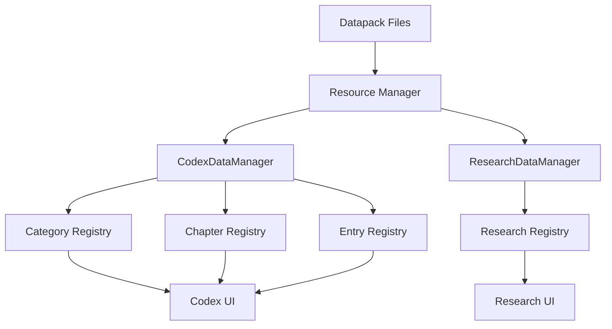

# System Overview

Understanding the architecture and relationships between different components of the Eidolon Unchained datapack system.

## 🏗️ Architecture Overview

The Eidolon Unchained datapack system is built on a hierarchical structure that allows for flexible content organization and cross-datapack compatibility.

```
┌─────────────────┐
│   CATEGORIES    │ ← Organize content by theme
├─────────────────┤
│    CHAPTERS     │ ← Group related topics  
├─────────────────┤
│     ENTRIES     │ ← Extend chapters with pages
├─────────────────┤
│    RESEARCH     │ ← Add progression requirements
└─────────────────┘
```

## 🗂️ Component Relationships

### Categories → Chapters
- **One-to-Many**: Each category can contain multiple chapters
- **Organization**: Categories group related chapters by theme
- **Display**: Categories appear as tabs/sections in the codex UI

### Chapters → Entries  
- **One-to-Many**: Each chapter can be extended by multiple entries
- **Extension**: Entries add pages to existing chapters
- **Modularity**: Multiple datapacks can contribute to the same chapter

### Chapters ↔ Research
- **Bidirectional**: Research can unlock chapters, chapters can reference research
- **Progression**: Research creates unlock requirements
- **Gating**: Control access to advanced content

## 📊 Data Flow



## 🔧 Core Systems

### 1. Category System
**Purpose**: Organize content into logical groups

**Files**: `data/yourmod/codex/category_name/_category.json`

**Features**:
- Custom icons and colors
- Localized names and descriptions
- Hierarchical organization
- Multiple chapters per category

### 2. Chapter System  
**Purpose**: Define content containers within categories

**Files**: `data/yourmod/codex/category_name/chapter.json`

**Features**:
- Base page content
- Category assignment
- Entry extension points
- Research integration

### 3. Entry System
**Purpose**: Add content to existing chapters

**Files**: `data/yourmod/codex_entries/entry.json`

**Features**:
- Target any chapter (cross-mod supported)
- Multiple page types
- Modular content addition
- No conflicts between entries

### 4. Research System
**Purpose**: Create progression and unlock requirements

**Files**: 
- `data/yourmod/research_chapters/chapter.json`
- `data/yourmod/research_entries/entry.json`

**Features**:
- Task-based progression
- Conditional requirements
- Reward systems
- Chapter unlock gating

## 🔄 Loading Process

### Phase 1: Resource Discovery
1. **Scan datapacks** for relevant JSON files
2. **Validate structure** and required fields
3. **Build dependency graph** between components

### Phase 2: Category Registration
1. **Load category definitions** from `_category.json` files
2. **Register with Eidolon** category system
3. **Apply custom icons/colors** and translations

### Phase 3: Chapter Processing
1. **Load chapter definitions** from category folders
2. **Process base page content**
3. **Register chapter-to-category** relationships

### Phase 4: Entry Integration
1. **Load entry definitions** from `codex_entries/`
2. **Match entries to target chapters**
3. **Append entry pages** to chapter content
4. **Handle cross-mod references**

### Phase 5: Research Integration
1. **Load research definitions**
2. **Process tasks and conditions**
3. **Link research to chapters**
4. **Register unlock requirements**

## 🌐 Cross-Mod Compatibility

### Namespace Handling
- **Automatic resolution**: `"target_chapter": "monsters"` → `yourmod:monsters`
- **Explicit targeting**: `"target_chapter": "eidolon:void_amulet"`
- **Cross-datapack**: `"target_chapter": "otherdatapack:spells"`

### Collision Prevention
- **Namespace isolation**: Each mod has its own space
- **Entry aggregation**: Multiple entries can target same chapter
- **Research independence**: Research trees don't conflict

### Integration Points
- **Eidolon base chapters**: Add content to existing Eidolon chapters
- **Third-party datapacks**: Extend other datapack content
- **Research prerequisites**: Reference research from other mods

## 📈 Performance Considerations

### Loading Optimization
- **Lazy loading**: Content loaded only when accessed
- **Caching**: Processed content cached for reuse
- **Dependency resolution**: Efficient graph traversal

### Memory Management
- **Resource cleanup**: Unused content garbage collected
- **Streaming**: Large content streamed as needed
- **Compression**: Translation data compressed

### Update Handling
- **Hot reloading**: `/reload` updates content without restart
- **Incremental updates**: Only changed content reprocessed
- **Rollback safety**: Invalid updates don't break existing content

## 🔍 Debug and Development

### Logging Levels
- **INFO**: Basic loading progress
- **DEBUG**: Detailed processing information  
- **WARN**: Non-critical issues
- **ERROR**: Critical failures

### Common Log Messages
```
[CodexDataManager]: Loading category: mystical_studies
[CodexDataManager]: Found 3 chapters in category: mystical_studies  
[CodexDataManager]: Processing entry: crystal_basics → crystal_magic
[ResearchDataManager]: Loaded research chapter: advanced_combat
```

### Development Tools
- **Live reload**: Changes appear immediately with `/reload`
- **Validation**: JSON syntax errors reported in console
- **Dependency tracking**: Missing references logged as warnings

## 🎯 Best Practices

### Content Organization
1. **Logical grouping**: Group related content in same category
2. **Clear hierarchy**: Use descriptive category and chapter names
3. **Modular design**: Small, focused entries rather than monolithic chapters

### Performance
1. **Minimize dependencies**: Avoid deep cross-mod references
2. **Efficient assets**: Optimize images and sounds
3. **Lazy loading**: Don't load everything upfront

### Compatibility
1. **Namespace everything**: Always use proper namespaces
2. **Version compatibility**: Document supported mod versions
3. **Graceful degradation**: Handle missing dependencies

## 📚 Related Documentation

- [Categories](categories.md) - Detailed category system documentation
- [Chapters](chapters.md) - Chapter creation and management
- [Codex Entries](codex-entries.md) - Entry system deep dive
- [Research System](research-system.md) - Research and progression
- [API Documentation](api/) - Developer integration guides
